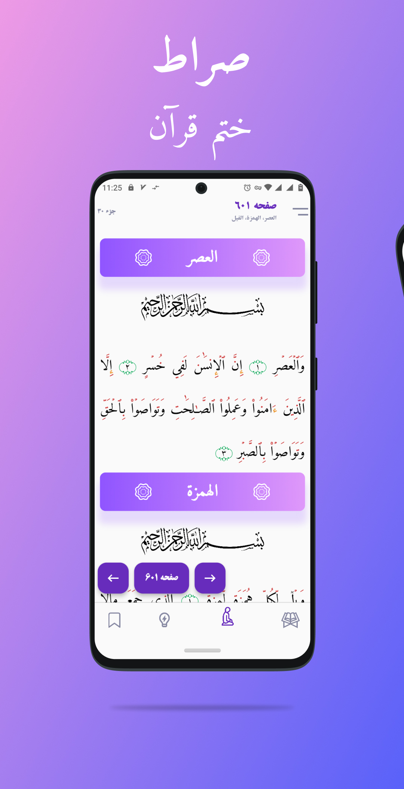

## Serat 🕮
Flutter application of reciting the Quran and finishing the Quran along with articles on the topic of prayer.

[](https://github.com/husen-hn/i_deen/releases/latest)

*ui designed by [Tanvir Ahassan](https://www.figma.com/community/file/966921639679380402/quran-app-concept-free)*

## Previews ⛶

   

## Contribute ༜
The development of this application has been completely stopped.

## License ©
```
Copyright © 2024 Hossein HassanNejad 
Licensed under the MIT.
```